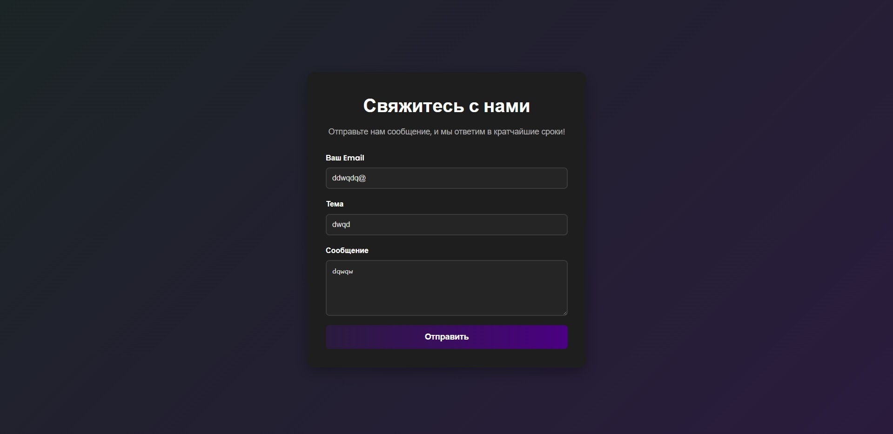

# Форма отправки email с PHPMailer и Gmail

Это простой PHP-проект, реализующий контактную форму, позволяющую пользователям отправлять письма с использованием библиотеки PHPMailer и SMTP-сервера Gmail. Форма разработана с современным интерфейсом в тёмной теме с использованием CSS и предназначена для тестирования или развёртывания на локальном сервере.

## Обзор проекта

Проект предоставляет отзывчивую веб-форму, где пользователи могут ввести свой адрес электронной почты, тему и сообщение. После отправки форма отправляет письмо через SMTP-сервер Gmail с использованием PHPMailer. Включена клиентская и серверная валидация для проверки заполнения всех полей и корректности адреса электронной почты. Интерфейс стилизован в тёмной теме, что делает его визуально привлекательным и удобным для пользователя.

## Как использовать

1. **Клонирование репозитория**:
   - Склонируйте репозиторий на локальную машину с помощью команды:
     ```
     git clone <url-репозитория>
     ```

2. **Настройка локального сервера**:
   - Установите среду локального сервера, такую как XAMPP, Local.
   - Разместите файлы проекта в корневой директории сервера (например, `local/app/public` для Local).

3. **Настройка параметров Gmail**:
   - Откройте `config.php` и обновите следующие константы своими данными Gmail:
     - `USERNAME`: Ваш адрес Gmail (например, `name@gmail.com `).
     - `PASSWORD`: Пароль приложения Gmail (16-значный код).
     https://support.google.com/accounts/answer/185833?hl=en
   - Убедитесь, что `SEND_FROM` и `REPLY_TO` указывают на действительные адреса электронной почты.

5. **Добавление SSL-сертификата**:
   - Скачайте файл `cacert.pem` с официального источника, например, [cURL's caextract](https://curl.se/ca/cacert.pem), и поместите его в директорию проекта.

6. **Запуск проекта**:
   - Запустите локальный сервер (например, Apache и MySQL в XAMPP, или если вы используете Local, вы просто запускаете локальный сайт ).
   - Откройте браузер и перейдите по адресу `http:/website.local`.
   - Заполните форму и нажмите "Отправить", чтобы отправить тестовое письмо.

## Иерархия файлов

```
project-root/
│
├── config.php          # Файл конфигурации с настройками SMTP Gmail
├── script.php          # PHP-скрипт, содержащий логику PHPMailer и функцию sendMail
├── index.php           # Основной HTML-файл с формой, обработкой PHP и валидацией JavaScript
├── styles.css          # CSS-файл для стилизации формы в тёмной теме
├── PHPMailer/          # Директория, содержащая файлы библиотеки PHPMailer
├── cacert.pem          # Файл SSL-сертификата для безопасного SMTP-соединения
```

## Требования для работы формы

- **Локальный сервер**: XAMPP, Local.
- **Библиотека PHPMailer**: Скачана и размещена в директории сайта.
- **Учётная запись Gmail**:
  - Сгенерирован пароль приложения для использования в `config.php`.
- **SSL-сертификат**: Файл `cacert.pem` для проверки SMTP-сервера Gmail.

## Возможности

- **Валидация формы**: Проверка пустых полей и валидация формата email с использованием стандартной HTML5-валидации браузера.
- **Тёмная тема**: Современный, отзывчивый дизайн с тёмной цветовой схемой.
- **Отправка писем**: Использование PHPMailer для отправки писем через SMTP-сервер Gmail.
- **Обработка ошибок**: Отображение удобных сообщений об ошибках или успехе на русском языке.

## Устранение неполадок

- **Письмо не отправляется**: Убедитесь, что пароль приложения верен, путь к `cacert.pem` указан правильно и есть интернет-соединение.

## Лицензия
Этот проект является открытым исходным кодом и распространяется под лицензией MIT. Вы можете изменять и распространять его по своему усмотрению.
